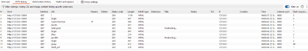
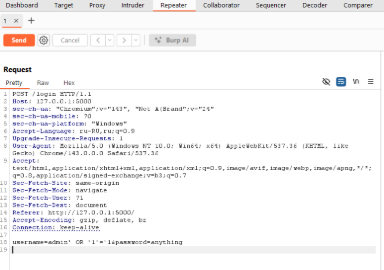
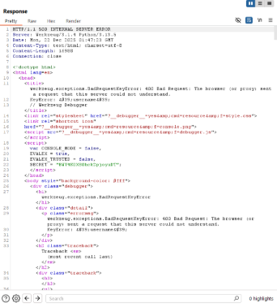
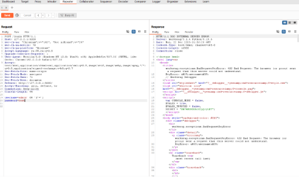
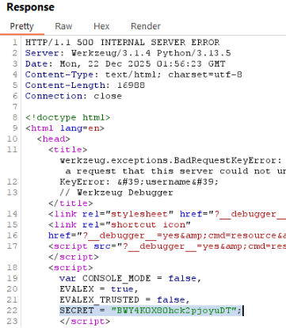

**Лабораторная работа №6**

**Моделирование этапов атаки по модели Cyber Kill Chain**

-----
**Цель работы**

Целью лабораторной работы является изучение модели Cyber Kill Chain и моделирование последовательных этапов кибератаки на примере уязвимого веб-приложения. В ходе работы демонстрируется логика действий злоумышленника, анализируются возможные векторы атаки и рассматриваются меры защиты на каждом этапе.

-----
**Описание лабораторной среды**

**Атакующая система:**

- Windows (локальный компьютер)

**Целевая система:**

- Уязвимое веб-приложение на Python (Flask)
- Адрес: http://localhost:5000

**Используемые инструменты:**

- Burp Suite (Community Edition)
- Nikto (запуск в Docker-контейнере)
- Веб-браузер

Специализированные дистрибутивы Linux (Kali, Ubuntu) и C2-фреймворки не использовались, так как цель работы заключается в моделировании Kill Chain, а не в эксплуатации конкретной операционной системы.

-----
**Моделирование атаки по этапам Cyber Kill Chain**

-----
**Этап 1 — Reconnaissance (Разведка)**

**Цель этапа:**\
Сбор информации о целевой системе и определение потенциальных точек входа.

**Выполненные действия:**

- Анализ веб-интерфейса приложения
- Автоматическое построение карты доступных эндпоинтов с помощью Burp Suite (Target → Site map)

**Результат:**\
Обнаружены следующие маршруты приложения:

- /login
- /search
- /ping
- /files
- /fetch\_url

  

**Вывод:**\
Веб-приложение предоставляет несколько эндпоинтов, потенциально уязвимых к атакам через пользовательский ввод.

**Контрмеры:**

- Минимизация публичных эндпоинтов
- Ограничение раскрытия информации
- Логирование и мониторинг запросов
-----
**Этап 2 — Weaponization (Создание оружия)**

**Цель этапа:**\
Подготовка средств для эксплуатации уязвимостей.

**Выполненные действия:**\
В качестве «оружия» были подготовлены вредоносные payload’ы для различных типов атак:

- SQL-инъекция:
- admin' OR '1'='1
- Reflected XSS:
- 
- Командная инъекция:
- 127.0.0.1; whoami

**Вывод:**\
Для эксплуатации веб-уязвимостей не требуется бинарных файлов — достаточно специально сформированных HTTP-запросов. 

**Контрмеры:**

- Валидация и фильтрация пользовательского ввода
- Использование параметризованных запросов
- Экранирование выводимых данных
-----
**Этап 3 — Delivery (Доставка)**

**Цель этапа:**\
Передача вредоносных данных целевому приложению.

**Выполненные действия:**

- Отправка подготовленных payload’ов через HTTP-запросы
- Использование Burp Repeater для ручной модификации параметров запросов

  

  

**Результат:**\
Payload’ы были успешно доставлены в обработчики серверной логики приложения.

**Контрмеры:**

- Web Application Firewall (WAF)
- Ограничение допустимых символов во входных данных
-----
**Этап 4 — Exploitation (Эксплуатация)**

**Цель этапа:**\
Достижение некорректного поведения приложения за счёт уязвимостей.

**Подтверждённые уязвимости:**

- **SQL Injection** — обход механизма аутентификации
- **Reflected XSS** — выполнение произвольного JavaScript-кода
- **Command Injection** — выполнение системных команд на сервере

**Результат:**\
Удалось выполнить произвольные действия, не предусмотренные логикой приложения. При отправке модифицированного POST-запроса к эндпоинту /login сервер вернул ошибку 500 Internal Server Error с отображением отладочной страницы Werkzeug. Данный факт указывает на отсутствие корректной валидации пользовательского ввода, а также на включенный режим отладки, что приводит к раскрытию внутренней информации о работе приложения.

**Контрмеры:**

- Подготовленные SQL-запросы
- Исключение использования shell=True
- Принцип минимальных привилегий
-----
**Этап 5 — Installation (Установка)**

**Цель этапа:**\
Закрепление возможности повторного использования атаки.

**Особенность сценария:**\
В рамках веб-приложения этап установки носит **логический характер**, а не файловый.

**Проявление установки:**

- Возможность повторного выполнения payload’ов
- Отсутствие механизмов блокировки после успешной эксплуатации

**Вывод:**\
Уязвимости позволяют атакующему сохранять контроль над приложением без необходимости повторной разведки.

**Контрмеры:**

- Исправление уязвимостей
- Контроль повторяющихся подозрительных запросов
-----
**Этап 6 — Command & Control (C2)**

**Цель этапа:**\
Организация канала управления атакой.

**Реализация в данном сценарии:**

- Канал управления реализован через HTTP-взаимодействие
- Burp Repeater используется как интерфейс отправки команд
- HTTP-ответы сервера выступают в роли канала обратной связи

**Вывод:**\
Даже без специализированного C2-фреймворка веб-приложение может служить каналом управления.

**Контрмеры:**

- Мониторинг аномальных HTTP-запросов
- IDS/IPS системы
- Ограничение команд, выполняемых на сервере
-----
**Этап 7 — Actions on Objectives (Достижение цели)**

**Цель этапа:**\
Демонстрация потенциального ущерба.

**Выполненные действия:**

- Получение информации о пользователе и системе
- Чтение файлов через уязвимые эндпоинты
- Нарушение целостности логики приложения

  

**Результат:**\
Были нарушены принципы конфиденциальности и целостности данных, что моделирует реальный ущерб для организации.

**Контрмеры:**

- Разграничение прав доступа
- Логирование действий
- Регулярные проверки безопасности
-----
**Ответы на контрольные вопросы**

1. **Дайте определение модели Kill Chain в контексте кибербезопасности.**

Модель Kill Chain представляет собой концептуальную схему, описывающую последовательность взаимосвязанных этапов кибератаки, которые проходит злоумышленник — от первоначального сбора информации о цели до реализации конечных намерений.

1. **Кто и с какой целью разработал классическую модель Cyber Kill Chain?**

Классическая модель Cyber Kill Chain была разработана американской оборонной корпорацией Lockheed Martin. Её основная цель заключалась в систематизации процесса проведения сложных кибератак и создании основы для разработки защитных мер, позволяющих выявлять и пресекать атаки на ранних стадиях.

1. **Перечислите семь этапов классической модели Cyber Kill Chain.**

1. Разведка (Reconnaissance)

1. Создание оружия (Weaponization)

1. Доставка (Delivery)

1. Эксплуатация (Exploitation)

1. Установка (Installation)

1. Командование и управление (Command & Control, C2)

1. Действия по достижению цели (Actions on Objectives)

1. **Какова основная оборонительная идея модели Kill Chain**?

Ключевая идея модели заключается в том, что успешная атака возможна только при прохождении всех этапов цепочки. Прерывание атаки на любом из них делает дальнейшее развитие невозможным, что позволяет реализовать многоуровневую защиту (Defense in Depth).

1. **На каком этапе Kill Chain осуществляется отправка фишингового письма?**

Фишинговая рассылка относится к этапу «Доставка» (Delivery), так как именно на этом этапе злоумышленник передаёт вредоносный контент или ссылку целевой стороне.

1. **Что представляет собой этап Command & Control (C2) и почему он критичен?**

Этап C2 подразумевает создание канала связи между атакующим и скомпрометированной системой. Он является критически важным, поскольку без него злоумышленник не способен управлять вредоносным кодом, получать данные, отдавать команды или развивать атаку.

1. **Приведите пример контрмеры на этапе «Доставка».**

В качестве контрмеры можно привести обучение пользователей основам кибергигиены и распознаванию фишинга в сочетании с техническими средствами защиты, такими как антиспам-фильтры и веб-фильтры, блокирующие доступ к вредоносным ресурсам.

1. **Опишите сценарий атаки с использованием ransomware через модель Kill Chain.**

Разведка: выявление организации с уязвимым программным обеспечением.

Создание оружия: подготовка или приобретение шифровальщика и его внедрение в документ.

Доставка: рассылка фишинговых писем сотрудникам.

Эксплуатация: выполнение вредоносного кода, например через макросы.

Установка: закрепление ransomware в системе.

C2: установление связи с сервером злоумышленника для передачи ключей.

Действия по цели: шифрование данных и отображение требования выкупа.

1. **Почему этапы «Доставка» и «Эксплуатация» считаются наиболее эффективными для обороны?**

Эти этапы происходят в зоне, где обычно развернуто максимальное количество защитных средств — антивирусы, IPS/IDS, EDR и межсетевые экраны. Успешная блокировка атаки на данных стадиях предотвращает её развитие и существенно снижает возможный ущерб.

1. **Каковы основные ограничения классической модели Cyber Kill Chain?**

Модель имеет линейный характер и не в полной мере отражает современные многоэтапные и итеративные атаки. Кроме того, она ориентирована преимущественно на внешнего нарушителя и слабо учитывает такие аспекты, как латеральное перемещение и инсайдерские угрозы.

1. **Как модель Kill Chain применяется при расследовании киберинцидентов?**

В ходе расследования специалисты сопоставляют действия злоумышленника с этапами Kill Chain, восстанавливая хронологию атаки. Это позволяет определить точку входа, использованные техники (TTPs), масштабы компрометации и перечень затронутых систем.

1. **В чем отличие этапов «Эксплуатация» и «Установка»?**

Эксплуатация представляет собой момент первоначального использования уязвимости для выполнения кода, тогда как установка направлена на закрепление в системе и создание устойчивого доступа, например путём установки бэкдора.

1. **Сравните этап «Разведка» в Kill Chain и тактику Reconnaissance в MITRE ATT&CK.**

Общим для обеих концепций является сбор информации о цели перед атакой. Отличие заключается в том, что в Kill Chain разведка — это единый линейный этап, тогда как в MITRE ATT&CK Reconnaissance является отдельной тактикой, включающей множество детализированных техник и применяемой неоднократно на разных стадиях атаки.

1. **Как концепция Defense in Depth связана с моделью Kill Chain?**

Модель Kill Chain логически дополняет концепцию «Обороны в глубину», предполагая размещение защитных механизмов на каждом этапе атаки. Такой подход повышает вероятность обнаружения и остановки злоумышленника даже при частичном обходе защиты.

1. **Почему инсайдерская угроза плохо описывается классической моделью Kill Chain? Приведите пример.**

Классическая модель ориентирована на внешнего нарушителя, которому необходимо пройти все начальные этапы атаки. Инсайдер же уже обладает легитимным доступом и может сразу перейти к поздним этапам. Например, сотрудник с доступом к данным может напрямую осуществить их копирование и передачу третьим лицам, минуя стадии разведки, доставки и эксплуатации.

-----
**Выводы**

В ходе лабораторной работы была успешно смоделирована атака по всем этапам модели Cyber Kill Chain на примере уязвимого веб-приложения. Работа показала, что даже без эксплуатации уязвимостей операционной системы атака может быть реализована полностью на уровне HTTP-взаимодействия.\
Модель Kill Chain позволяет системно анализировать действия злоумышленника и выстраивать эшелонированную защиту, направленную на разрыв цепочки атаки на ранних этапах.

