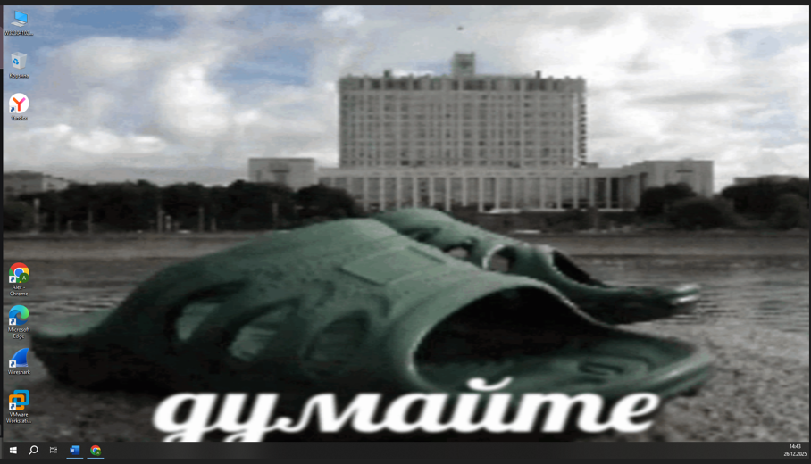
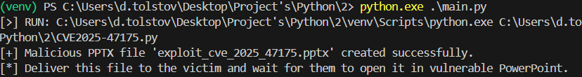
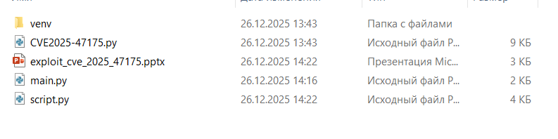
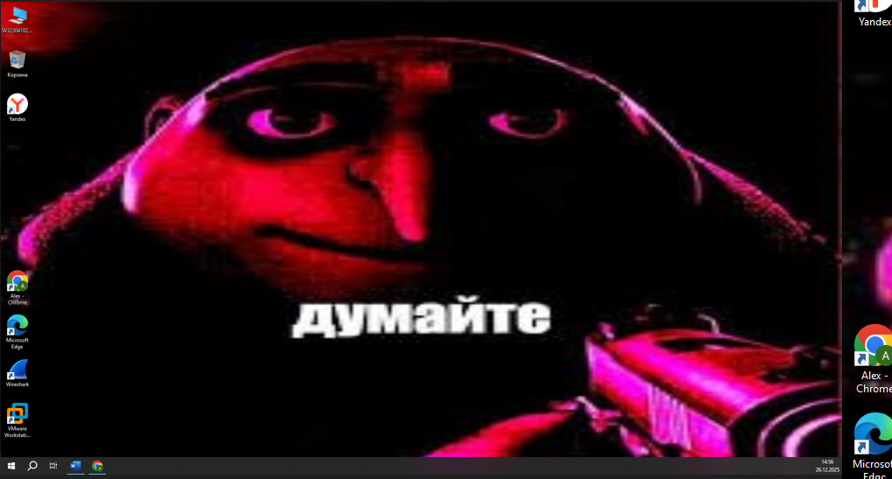
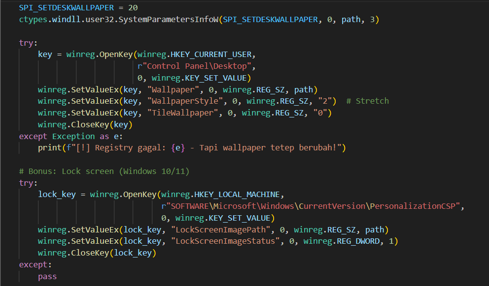
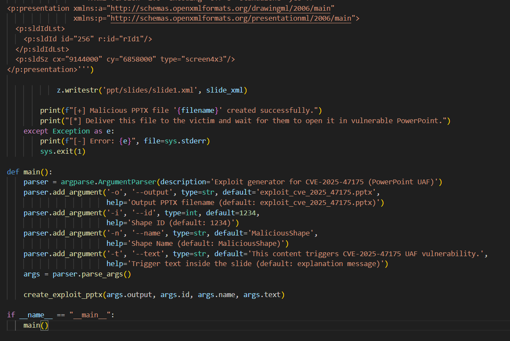

> ⚠️ **Только для легального тестирования и обучения.**  

## Описание

Страница демонстрирует сценарий, при котором уязвимость **CVE-2025-47175** *может приводить к несанкционированному изменению настроек рабочего стола*, включая **смену фона (wallpaper)**, при определённых условиях окружения и конфигурации.

Это изначальный фон рабочего стола

<h4 align="center" style="margin: 5px 0 30px 0;">Рисунок 1 - изначальный фон рабочего стола</h4>

<h4 align="center" style="margin: 5px 0 30px 0;">Рисунок 2 - Формирование вредоносного pptx файла</h4>

<h4 align="center" style="margin: 5px 0 30px 0;">Рисунок 3 - Результат создания вредоносного файла </h4>

<h4 align="center" style="margin: 5px 0 30px 0;">Рисунок 4 - результат выполнения скрипта</h4>

<h4 align="center" style="margin: 5px 0 30px 0;">Рисунок 5 - фрагмент кода выполнения смены фона рабочего стола</h4>

<h4 align="center" style="margin: 5px 0 30px 0;">Рисунок 5 - фрагмент кода формирования pptx файла</h4>
